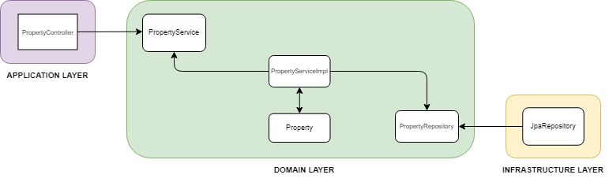

# Properties Service

## Funkcionalne zahteve

- Uporabniki lahko pregledajo podrobnosti o posamezni nepremičnini.
- Uporabniki lahko vstopijo v kontakt direktno z lastnikom nepremičnine.
- Administratorji lahko nepremičnino umaknejo iz strani.

## Nefunckionalne zahteve

- Storitev mora zagotavljati hitre odgovore za boljšo uporabniško izkušnjo.
- Storitev mora biti visoko razpoložljiva z minimalno nedostopnostjo.
- Storitev mora biti skalabilna, z zmožnostjo obdelave velikega števila vzporednih zahtev.