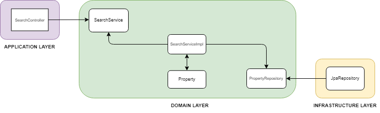

# Search Service

## Funkcionalne zahteve

- Uporabniki lahko nepremičnine iščejo po lokaciji, ceni in drugih kriterijih.
- Uporabniki lahko nepremičnine sortirajo po raznih kriterijih.
- Seznam nepremičnin mora podpirati paginacijo.

## Nefunckionalne zahteve

- Storitev mora zagotavljati hitre odgovore za boljšo uporabniško izkušnjo.
- Storitev mora biti visoko razpoložljiva z minimalno nedostopnostjo.
- Storitev mora biti skalabilna, z zmožnostjo obdelave velikega števila vzporednih zahtev.

