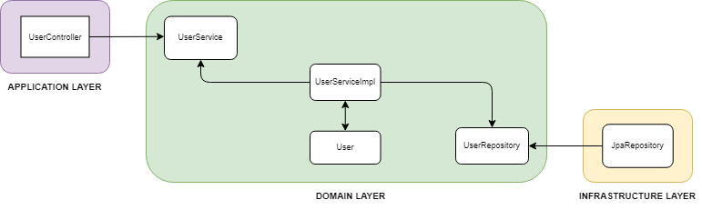

# User Service

When the service is running, you can access the API documentation at
http://localhost:8080/swagger-ui.html and at http://localhost:8080/v3/api-docs

## Funkcionalne zahteve

- Uporabniki lahko ustvarijo račun z e-pošto in geslom.
- Uporabniki se lahko prijavijo v aplikacijo s svojimi poverilnicami.
- V primeru pozabe geslo lahko uporabniki geslo zahtevajo preko e-pošte.

## Nefunckionalne zahteve

- Storitev mora zagotavljati, da so gesla shranjena z uporabo zgoščevalnih funkcij.
- Storitev mora biti visoko razpoložljiva z minimalno nedostopnostjo.
- E-pošta o potrditvi računa se mora poslati prej kot v eni uri.